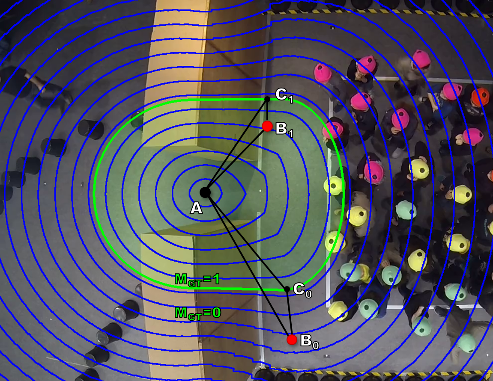

# WIP bottleneck-detection-benchmark
##Ground Truth data and evaluation tool for bottleneck detection in crowds of people.

We provide the GT masks as well as the evaluation tool for bottleneck detection here.

This project is released under the MIT License (details in LICENSE file). If you think our work is useful in your research, please consider citing:

[Video-based Bottleneck Detection utilizing Lagrangian Dynamics in Crowded Scenes](https://arxiv.org/pdf/1908.07772.pdf)

```
@INPROCEEDINGS{8909861,  
author={Simon, Maik and Küchhold, Markus and Senst, Tobias and Bochinski, Erik and Sikora, Thomas},  
booktitle={2019 16th IEEE International Conference on Advanced Video and Signal Based Surveillance (AVSS)},   
title={Video-based Bottleneck Detection utilizing Lagrangian Dynamics in Crowded Scenes},   
year={2019},
pages={1-8},  
doi={10.1109/AVSS.2019.8909861}}

```

Visualization of the localization error &epsilon;<sub>d</sub>  estimation, the ground truth bottleneck detection (A) and the &epsilon;<sub>d</sub> ground truth bottleneck mask MGT (framed by green line).
&epsilon;<sub>d</sub> is computed by the relation between the distances between the ground truth detection (A), the estimated detection’s (B0,B1) and the nearest point to the bottleneck mask
(C0,C1). Each blue line shows the increasing isometric &epsilon;<sub>d</sub>.

[](bn_localization error)

## Dataset:

[AGORASET](https://www.sites.univ-rennes2.fr/costel/corpetti/agoraset/Site/Scenes.html) (4 videos)

[Jülich - Pedestrian Dynamics Data Archive](https://doi.org/10.34735/ped.da)
- [Bottleneck and social groups:](https://doi.org/10.34735/ped.2014.1)
  - Datasets: School GymBay (39 videos) AND School WDG (12 videos)

- [Entrance-1](https://doi.org/10.34735/ped.2013.2) (1 video)
- [Entrance-2](https://doi.org/10.34735/ped.2013.1) (1 video)

- [Bottleneck](https://doi.org/10.34735/ped.2009.6) (10 videos) (ao)
- [Bottleneck, Caserne (camera 1)](https://doi.org/10.34735/ped.2006.2) (13 videos)


